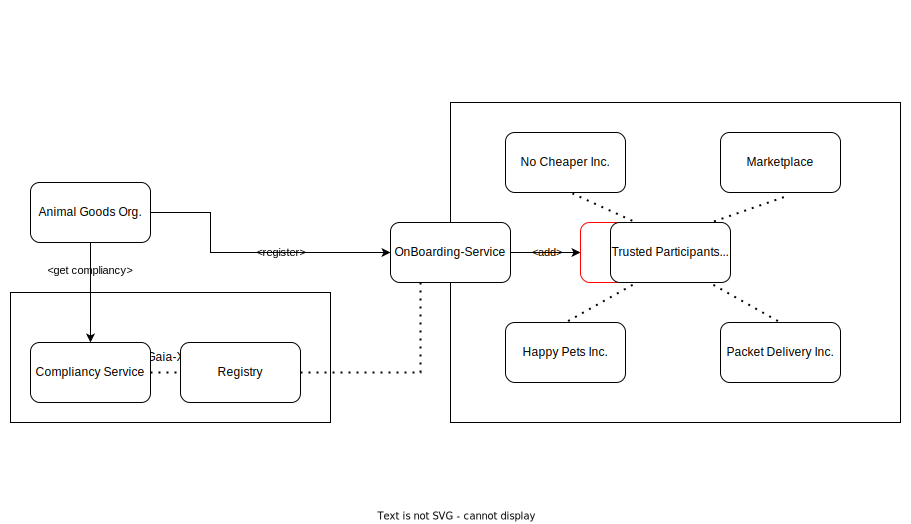
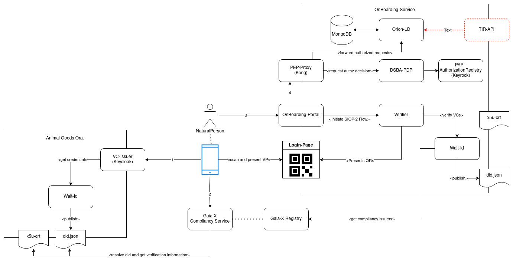
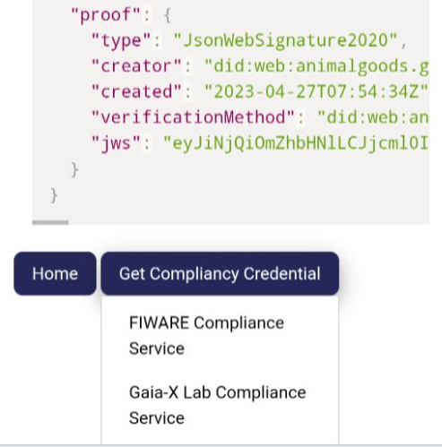

# Tech-X-Challenge

This repository contains information about the hackathon "Gaia-X compliant Trust and IAM framework", which happens at the [Tech-X Conference and Hackathon #6](https://gaia-x.eu/tech-x/)  in Bilbao. 

## The Use-Case

[i4Trust](https://i4trust.org/) is a Trust and IAM framework, used for building collaborative dataspaces, based on [FIWARE](https://www.fiware.org/) and [iShare](https://dev.ishareworks.org/index.html). Access to data and services in those dataspaces is protected through a decentralized IAM framework, where individual clients dont have to be registered individually, but can be vouched for by existing participants, that are already trusted inside the dataspace. The trust between the participants is provided through a trust-anchor service, called "iShare-Satellite". It implements a list of trusted participants, which can be used by the companies to ensure they are only talking to trusted partners.

This framework for example allows to offer services through a marketplace, where participants of the dataspace can sell and buy access to each others services. In our use-case, a company called ```Packet Delivery Co.``` is offering digital serivces around its "traditional" logistics services. Participants in the dataspace can buy access to those services and offer them to there customers. ```Packet Delivery Co.``` currently offers two types of services, the "Gold-Service" and the "Standard-Service". Users with access to "Gold-Services" are allowed to not only access information about there Packet-Deliveries(e.g. planned time of arrival), but also can change those values to better fit there needs(e.g. deliver when I'm at home). Users with "Standard-Service" can only see the times, but not change them. 
In our use-case, the company ```No Cheaper Inc.``` is running an online shop, selling variuous goods on small prices. They use ```Packet Delivery Co.``` to deliver those products, but don't want to offer their users additional benefits. Therefor it has only bought "Standard-Services", which allows the users to view the planned arrivals.

```Happy Pets Inc.``` however, offers various products for pet owners and wants to offer them also the option to update the planned time of arrival. As a participant of the dataspace, it just buys access to the "Gold-Service" at the marketplace and is now allowed to issue credentials to its customers, allowing to change the pta.

Happy Pets' competitor ```Animal Goods Org.``` decides to also offer its customers the services of ```Packet Delivery Co.```. Since they are quite new on the market, they are not yet part of the dataspace. In order to do so, they have to properly on-board themself to the dataspace and then can also buy access. For doing so, it create a [Gaia-X compliant self-description](https://gaia-x.gitlab.io/policy-rules-committee/trust-framework/)[^1], containing various legal informations required for companies in the european union. To proof the legitimacy of those informations, they get a ```Compliancy Credential``` from  the [Gaia-X Compliancy Service](https://compliance.lab.gaia-x.eu/development/docs/#/Common/CommonController_issueVC)[^2]. With those two credentials, a legal representative can use the OnBoarding-Service of the dataspace to register ```Animal Goods Org.``` as a new participant. The representative identifies itself with a credential[^3], too. 

Once this is done, ```Animal Goods Org.``` can access the marketplace and also buy the "Gold-Service" for its customers.

[^1]: Example self-description: 
    ```json
    {
        "type" : [ "VerifiableCredential" ],
        "@context" : [ "https://www.w3.org/2018/credentials/v1", "https://registry.lab.gaia-x.eu/development/api/trusted-shape-registry/v1/shapes/jsonld/trustframework#", "https://w3id.org/security/suites/jws-2020/v1" ],
        "id" : "urn:uuid:a4c51032-1aab-46ba-8f51-68210a60cc27",
        "issuer" : "did:web:animalgoods.gaia-x.fiware.dev:did",
        "issuanceDate" : "2023-04-26T09:17:52Z",
        "issued" : "2023-04-26T09:17:52Z",
        "validFrom" : "2023-04-26T09:17:52Z",
        "expirationDate" : "2023-04-28T21:17:52Z",
        "credentialSubject" : {
            "id" : "did:web:animalgoods.gaia-x.fiware.dev:did",
            "type" : "gx:LegalParticipant",
            "gx:legalName" : "Animal Goods Org.",
            "gx:legalRegistrationNumber" : {
            "gx:vatID" : "MYVATID"
            },
            "gx:headquarterAddress" : {
            "gx:countrySubdivisionCode" : "BE-BRU"
            },
            "gx:legalAddress" : {
            "gx:countrySubdivisionCode" : "BE-BRU"
            },
            "gx-terms-and-conditions:gaiaxTermsAndConditions" : "70c1d713215f95191a11d38fe2341faed27d19e083917bc8732ca4fea4976700"
        },
        "proof" : {
            "type" : "JsonWebSignature2020",
            "creator" : "did:web:animalgoods.gaia-x.fiware.dev:did",
            "created" : "2023-04-26T09:17:52Z",
            "verificationMethod" : "did:web:animalgoods.gaia-x.fiware.dev:did#e1b0c827edd5446ebb830d9a8b9b748c",
            "jws" : "eyJiNjQiOmZhbHNlLCJjcml0IjpbImI2NCJdLCJhbGciOiJQUzI1NiJ9..SGj9KmaiowH2NOVJtWDN9tnAN4MivHJ2QdijCbTv-7V3ZXXtXrLI7qNkOMyxX9LwJv83S6USWFNoqWiluB8CiGYkfFe1FexqWBbodIIqxCM0xO7k2y78Zy_aMTjWkcFuKeGtELL6VeBnQglQauAOMOX60_-TRxNp96K8bJ-8O7EfJQhJnDVq5Dx6XE6oG4_vQyeDPafxb1_JmtjqG0aZ5b8ZRjPYkCYzpeomV4hAtOCT8xN7W6d7vAw07IeVZ_mcvk4OmS6hKND2x3g_gLfroTf43kx0sI-HeD6x4F3wCb_yFvxzolXZ4yI-f-JHalTwFuLJUKlrhNPsjse1eqRGCQ"
        }
    }
    ```

[^2]: Compliancy Credential: 
    ```json
    {
        "@context": [
            "https://www.w3.org/2018/credentials/v1",
            "http://gx-registry-development:3000/development/api/trusted-shape-registry/v1/shapes/jsonld/trustframework#"
        ],
        "type": [
            "VerifiableCredential"
        ],
        "id": "https://storage.gaia-x.eu/credential-offers/b3e0a068-4bf8-4796-932e-2fa83043e203",
        "issuer": "did:web:compliance.lab.gaia-x.eu:development",
        "issuanceDate": "2023-04-26T09:19:11.791Z",
        "expirationDate": "2023-07-25T09:19:11.791Z",
        "credentialSubject": [
            {
            "type": "gx:compliance",
            "id": "did:web:raw.githubusercontent.com:egavard:payload-sign:master",
            "integrity": "sha256-9fc56e0099742e57d467156c4526ba723981b2e91eb0ccf6b725ec65b968fcc8"
            }
        ],
        "proof": {
            "type": "JsonWebSignature2020",
            "created": "2023-04-26T09:19:12.415Z",
            "proofPurpose": "assertionMethod",
            "jws": "eyJhbGciOiJQUzI1NiIsImI2NCI6ZmFsc2UsImNyaXQiOlsiYjY0Il19..bSsi9yohByC9021w1AiLvzgIozgYqTAWLBkEWC8Qay043k81p6UzWfZ04rFv48agxkzDHwCxlFGO_N24SLJvHieZwRJnyoM-VfIYfSJ-9iTI07TMQl-wd03sO5x4R8YWIDeSd3hoWkn5csmQYhQlXmwLRKpMni0qgMMmMTR336XkSImq5NpEiB8QzwJVkmjn4oHHELwEPa3HSfAl42lTUvAwQceaNU288QrPC0ykRW4mdPmKk5TXgkf19tolj8xwhr-pncVv_0D7LH3bYoFzzvNBeQQZ3LOT5tr9QD6AjIJN126gX1ia6gMdmj5SKT_7KgtWk9npsKg3hggpbnihBA",
            "verificationMethod": "did:web:compliance.lab.gaia-x.eu:development"
        }
    }
    ```

[^3]: Natural Person Credential: 
    ```json
    {
        "type" : [ "VerifiableCredential", "NaturalPersonCredential" ],
        "@context" : [ "https://www.w3.org/2018/credentials/v1", "https://w3id.org/security/suites/jws-2020/v1" ],
        "id" : "urn:uuid:2eff859a-1474-4e51-a897-0e1360fecff9",
        "issuer" : "did:web:animalgoods.gaia-x.fiware.dev:did",
        "issuanceDate" : "2023-04-26T09:41:32Z",
        "issued" : "2023-04-26T09:41:32Z",
        "validFrom" : "2023-04-26T09:41:32Z",
        "expirationDate" : "2023-04-28T21:41:32Z",
        "credentialSchema" : {
            "id" : "https://raw.githubusercontent.com/FIWARE-Ops/tech-x-challenge/main/schema.json",
            "type" : "FullJsonSchemaValidator2021"
        },
        "credentialSubject" : {
            "id" : "d7704c3f-4f13-474d-980c-6036ef670157",
            "type" : "gx:NaturalParticipant",
            "familyName" : "Happy",
            "firstName" : "User",
            "roles" : [ {
            "names" : [ "LEGAL_REPRESENTATIVE" ],
            "target" : "did:web:onboarding.gaia-x.fiware.dev:did"
            } ],
            "email" : "legal-representative@happypets.org"
        },
        "proof" : {
            "type" : "JsonWebSignature2020",
            "creator" : "did:web:animalgoods.gaia-x.fiware.dev:did",
            "created" : "2023-04-26T09:41:32Z",
            "verificationMethod" : "did:web:animalgoods.gaia-x.fiware.dev:did#4057b20fdc4a4c25abaab4f44de95c0f",
            "jws" : "eyJiNjQiOmZhbHNlLCJjcml0IjpbImI2NCJdLCJhbGciOiJQUzI1NiJ9..Wm4S4chhXVYAibziWZ6HFUntav8xQz6iG9Lc-qyjnmeHeDrPvOnEMbKqQ1EmKzRhq1XHVl_yTEKo0T5F26ArbDokvaz-dK9LPa3PNkY8S-s5CAi5ufAIuO8FFqbCmonGr140U9_iLGYqaXEYpK9-AjmKl_-jB88jFlBxapbKEKGdHH1vrhggL_xbNmgbcRlueRgOWmHzy2RhFnzHxmpiCl6cvsHKB6dT-Q-VfBvwYExrJqGzLiGvxcNcqKnZ1OVEmaI7KPKQ8GBTvdp7P46gEVLlW_BQYdv3uDlHnoTZhz4ufJBLwMqiYrXvMmmscllnH_BUv2lUYXPRRBdSBD3EBA"
        }
    }
    ```

## The Challenge



While the i4Trust framework for Dataspaces is well established, working and already used in multiple dataspaces(see [i4Trust experiments](https://i4trust.org/experiments/)) and a solution for the OnBoarding-Service, combining the i4Trust IAM-Framework with Gaia-X compliancy, there integration is yet to be finished.

In order to properly on-board new participants to an i4Trust-Dataspace, the [Satellite-Implementation](https://github.com/FIWARE/ishare-satellite) needs to be evolved to get participant information from the OnBoarding-Service. 
Therefor, in the hackathon, we want to implement:
* an [EBSI Trusted Issuers Registry](https://api-pilot.ebsi.eu/docs/apis/trusted-issuers-registry/latest#/) compliant endpoint, based on the NGSI-LD Api. This could either be an extension to the already existing Satellite-implementation or a completely new service.
* [optional] Implement additional endpoints from the [satellite-api](https://github.com/FIWARE/ishare-satellite/tree/main/api)([Spec](https://dev.ishare.eu/scheme-owner/parties-id.html)) 
* [optional] Extend the LegalPerson-Credential to include iShare-related data, like the certificate or the EORI

Goal: 
In order to show the improvements to the integration, the following steps should be presented:
* issue a Self-Description for Animal Goods Org.[^4]
* get a Compliancy Credential[^5]
* get a NaturalPerson Credential for Animal Goods Org.
* register Animal Goods Org. at the [OnBoarding-Portal](https://portal.gaia-x.fiware.dev/)
* take just the NaturalPerson credential and verify it against the new service[^6]

[^4]: The [FIWARE Demo-Wallet](demo-wallet.fiware.dev) and the [Animal Goods Org. Keycloak](animalgoods-kc.gaia-x.fiware.dev) can be used for example.

[^5]: To make issuing easier, a compliancy service trusting our participants is provided at [https://compliance.gaia-x.fiware.dev](https://compliance.gaia-x.fiware.dev/docs/#/credential-offer/CommonController_issueVC) 

[^6]: Verfiy for example at [Walt-id](https://kong.gaia-x.fiware.dev/walt/v1/verify)

## Demo Setup - The On-Boarding Service 

All components are deployed via GitOps. The deployments can be found at: https://github.com/FIWARE-Ops/fiware-gitops/tree/master/aws/gaia-x



The diagram shows the relevant components and their interaction. They are not necessarily in the provided sequence, but their are certain dependencies between some steps.

1. The person("NaturalPerson") receives a LegalPerson-Credential[^1] and a NaturalPerson-Credential[^3], containing the self-descrption of the organisation and the identity of the user itself. The NaturalPerson-Credential is issued by the organisation described in the LegalPerson-Credential.
    * The issuer([Keycloak](https://github.com/wistefan/keycloak-vc-issuer)) uses [WaltId](https://github.com/walt-id/waltid-ssikit) to get the actual credential
    * WaltId maintains the DID(and corresponding private key) of the organization, therefor is also responsible to publish the did.json required for [did:web](https://w3c-ccg.github.io/did-method-web) - this happens through [route-rewriting](https://github.com/FIWARE-Ops/fiware-gitops/blob/master/aws/gaia-x/walt-id/templates/route.yaml#L10) to WaltId's [Core-API](https://docs.walt.id/v/ssikit/getting-started/rest-apis/core-api)
    * the participant also publishes its certificate-chain, defined in the x5u-parameter of the did.json, as mandated by the Gaia-X complinacy service(in a real environment, the certificate-chain needs to be derived from a Gaia-X trusted CA. To ease the demo-environment, we use [Let's encrypt](https://letsencrypt.org/) provided certificates here)
2. The person uses its wallet(on the mobile phone) to also retrieve a CompliancyCredential[^2] for the LegalPerson-Credential from the Gaia-X ComplinacyService
    * the [FIWARE Demo-Wallet](demo-wallet.fiware.dev) provides a button to request such credential for any stored credential
        
    * the [Compliancyservice](https://gaia-x.gitlab.io/policy-rules-committee/trust-framework/trust_anchors/) will check the credential according to the Gaia-X rules and send back a credential to the wallet
3. In order to OnBoard the participant(e.g. ```Animal Goods Org.```), the user accesses the [OnBoarding-Portal](https://portal.gaia-x.fiware.dev/)
    * the portal will forward the user to the Login-Page of the verifier, which displays a QR-Code, containing all information to fullfil the [SIOP-2](https://openid.net/specs/openid-connect-self-issued-v2-1_0.html)/[OIDC4VP](https://openid.net/specs/openid-4-verifiable-presentations-1_0.html)-Flow 
    * the user scans the code with its wallet and let it send all credentials as a [VerfiablePresentation](https://www.w3.org/TR/vc-data-model/#dfn-verifiable-presentations)
    * the verifier will now check all (3) credential it did receive:
        * verify the signature, issuance-date and vaildity-timeframe for each of the credentials
        * checks that the CompliancyCredential was issued by a CompliancyService registered in the Gaia-X Registry(see [demo-registry](https://registry.gaia-x.fiware.dev/development/api/complianceIssuers))
        * checks that the CompliancyCredential actually proofs the compliancy of the LegalPerson-Credential and that the NaturalPerson-Credential was issued by the LegalPerson, thus building a chain-of-trust between the credentials up towards the Gaia-X CompliancyService
    * creates a JWT containing the VerifiablePresentation and provide it to the portal via the [token-endpoint](https://datatracker.ietf.org/doc/html/rfc6749#page-21)
4. The portal now uses the JWT to access the backend-services
    * it requests the [Orion-LD ContextBroker](https://github.com/FIWARE/context.Orion-LD), using the [NGSI-LD Api](https://www.etsi.org/deliver/etsi_gs/CIM/001_099/009/01.06.01_60/gs_cim009v010601p.pdf) to get or create participants
    * all requests go through the [Kong API-Gateway](https://konghq.com/)
    * the requests are forwarded to the [DSBA-PDP](https://github.com/FIWARE/dsba-pdp) by the [PEP-Plugin](https://github.com/FIWARE/kong-plugins-fiware/tree/main/kong-pep-plugin) to get an authorization-decision
    * the PDP checks the request in context of the roles inside then NaturalPerson-Credential, using the [iShare-compliant Authorization Registry](https://dev.ishare.eu/delegation/endpoint.html) 
    * if allowed, it forwards the request to the ContextBroker to be answered
5. :warning: Step 5 is not implemented yet, therefor becomes the challange. In order to connect the OnBoarding-Service with actual Dataspaces, a services implementing the [EBSI Trusted Issuers Registry API](https://api-pilot.ebsi.eu/docs/apis/trusted-issuers-registry/latest#/) retrieves the TrustedIssuers-Information from the ContextBroker and provide them to the Dataspace.  

### Available endpoints:

| Address| Paths | Description | Security |  
|--------|-------|-----------|----------|
| https://portal.gaia-x.fiware.dev/ | | OnBoarding Portal | login via VerifiableCredentials |
| https://animalgoods-kc.gaia-x.fiware.dev/ | realms/fiware-server/account/#/ | Keycloak of Animal Goods Org. for retrieving VCs | Users: ```legal-representativ```, ```standard-employee``` pw==username |
| https://demo-wallet.fiware.dev/ | | FIWARE Demo Wallet | none |
| https://compliance.gaia-x.fiware.dev/docs/# | docs/# | FIWARE instance of the Gaia-X compliancy serivce, trusted in the demo-environment   | none |
| https://registry.gaia-x.fiware.dev/ | |Mock instance of the Gaia-X Registry, used to trust the demo compliancy service | none |
| https://animalgoods.gaia-x.fiware.dev | /did/did.json | Json-Document, allowing to resolve did:web:animalgoods.gaia-x.fiware.dev:did | none |
| https://animalgoods.gaia-x.fiware.dev | /certs | Certifcate chain, referenced by the did.json | none |
| https://onboarding.gaia-x.fiware.dev | /did/did.json | Json-Document, allowing to resolve did:web:onboarding.gaia-x.fiware.dev:did | none |
| https://onboarding.gaia-x.fiware.dev | /certs | Certifcate chain, referenced by the did.json | none |
| https://ar.gaia-x.fiware.dev | | Authorization-Registry, used by the OnBoarding-Service | iShare-specific | 
| https://kong.gaia-x.fiware.dev | /token | Token helper to get iShare-compliant JWT. Used for setting up the policies | X-Api-Key[^7]|
| https://kong.gaia-x.fiware.dev | /tir | Orion-LD access for implementing the Trusted Issuers Registry. | X-Api-Key[^7]|
| https://kong.gaia-x.fiware.dev | /walt | Instance of WaltId, can be used to verify credentials against the TIR. | X-Api-Key[^7]|
| https://kong.gaia-x.fiware.dev | /vc | Access to Orion-LD, used by the portal. Authorization through the PDP. | JWT |


[^7]: Some APIs are not typically public available, but provided for the hackathon to support the development and testing. They are secured, using Kong's API-Key functionality. Provide the key as ```X-Api-Key```-header. Get one: 
    ```shell
        export KONG_POD=$(kubectl get pods -n gaia-x --no-headers -o custom-columns=":metadata.name" | grep kong)
        kubectl port-forward ${KONG_POD} 8001:8001 -n gaia-x
        curl --location 'localhost:8001/key-auths' | jq -r '.data[0].key')
    ```

### Component Links

The setup uses various opensource components, the following table contains links to most of them:

| Component | Role |          |
|-----------|---|----------|
| Keycloak-Provider | VC-Issuer | https://github.com/wistefan/keycloak-vc-issuer |
| Keyrock | AuthorizationRegistry | https://github.com/i4Trust/fiware-idm |
| Gaia-X CompliancyService | CompliancyService | https://gitlab.com/gaia-x/lab/compliance/gx-compliance |
| Gaia-X Registry | Trust Registry for Compliancy | https://gitlab.com/gaia-x/lab/compliance/gx-registry / https://github.com/wistefan/gaia-x-registry-mock | 
| Kong-Plugins | Api-Gateway | https://github.com/FIWARE/kong-plugins-fiware |
| Orion-LD | ContexBroker, Trusted Issuers Storage | https://github.com/FIWARE/context.Orion-LD |
| DSBA-PDP | Policy Decision Point | https://github.com/FIWARE/dsba-pdp |  
| Portal | OnBoarding Frontend | https://github.com/i4Trust/pdc-portal/tree/bilbao |
| Satellite | Trust Anchor | https://github.com/FIWARE/ishare-satellite |
| Verifier | Verifier of VerifiableCredentials&Presentations | https://github.com/FIWARE/VCVerifier |
| WaltId | Backend for managing Credentials and DIDs | https://github.com/walt-id/waltid-ssikit |
| Token-Helper | Support for iShare-JWT | https://github.com/wistefan/ishare-jwt-helper |
| Demo-Wallet | Credentials-Wallet | https://github.com/FIWARE/VCWallet | 

## Data models

The demo-setup stores issuers as [NGSI-LD Enities](https://www.etsi.org/deliver/etsi_gs/CIM/001_099/009/01.06.01_60/gs_cim009v010601p.pdf), using the following format:

```json
{
   "id":"urn:ngsi-ld:TrustedIssuer:did:web:animalgoods.gaia-x.fiware.dev:did",
   "type":"TrustedIssuer",
   "issuer":{
       "type":"Property",
       "value":"did:web:animalgoods.gaia-x.fiware.dev:did"
    },
    "selfDescription":{
        "type":"Property",
        "value":{
            "gx-terms-and-conditions:gaiaxTermsAndConditions":"70c1d713215f95191a11d38fe2341faed27d19e083917bc8732ca4fea4976700","gx:headquarterAddress":{
                "gx:countrySubdivisionCode":"BE-BRU"
                },
            "gx:legalAddress":{
                "gx:countrySubdivisionCode":"BE-BRU"
                },
            "gx:legalName":"Animal Goods Org.",
            "gx:legalRegistrationNumber":{
                "gx:vatID":"MYVATID"
                },
            "id":"did:web:animalgoods.gaia-x.fiware.dev:did",
            "type":"gx:LegalParticipant"
        }
    }
}
```

## Preparational Steps

In order to work, both participants have to be registered in their corresponding Walt-Id instance.
To do so, identify the instances running walt-id.

```shell
export ONBOARDING_WALT=$(kubectl get pods -n gaia-x --no-headers -o custom-columns=":metadata.name" | grep walt-id-onboarding-vcwaltid | grep -v "certs")

export PARTICIPANT_WALT=$(kubectl get pods -n gaia-x --no-headers -o custom-columns=":metadata.name" | grep walt-id-vcwaltid | grep -v "certs")
```

Then make the core-service locally available, via port-forwarding:
```shell
kubectl port-forward ${ONBOARDING_WALT} 7000:7000 -n gaia-x
kubectl port-forward ${PARTICIPANT_WALT} 6000:7000 -n gaia-x
```

In order to register the DID properly, first get the private key. 

```shell
export ONBOARDING_RSA=$(kubectl get secret gaia-x-walt-id-onboarding-vcwaltid-tls-sec -o jsonpath="{.data['tls\.key']}"  -n gaia-x | base64 --decode)
export PARTICIPANT_RSA=$(kubectl get secret gaia-x-walt-id-vcwaltid-tls-sec -o jsonpath="{.data['tls\.key']}"  -n gaia-x | base64 --decode)
```
And import it to walt-id:

```shell
export ONBOARDING_KEY=$(curl --location 'localhost:7000/v1/key/import' \
--header 'Content-Type: text/plain' \
--data "${ONBOARDING_RSA}" | jq -r '.id')


export PARTICIPANT_KEY=$(curl --location 'localhost:6000/v1/key/import' \
--header 'Content-Type: text/plain' \
--data "${PARTICIPANT_RSA}" | jq -r '.id')
```

You will receive a key-id as a response. With that ID, register the did:
```shell 
curl --location 'localhost:7000/v1/did/create' \
--header 'Content-Type: application/json' \
--data "{
    \"method\": \"web\",
    \"keyAlias\":\"${ONBOARDING_KEY}\",
    \"domain\": \"onboarding.gaia-x.fiware.dev\",
    \"path\": \"did\",
    \"x5u\": \"https://onboarding.gaia-x.fiware.dev/certs/tls.crt\"
}"

curl --location 'localhost:6000/v1/did/create' \
--header 'Content-Type: application/json' \
--data "{
    \"method\": \"web\",
    \"keyAlias\":\"${PARTICIPANT_KEY}\",
    \"domain\": \"animalgoods.gaia-x.fiware.dev\",
    \"path\": \"did\",
    \"x5u\": \"https://animalgoods.gaia-x.fiware.dev/certs/tls.crt\"
}"
```
After that step, the did.json should be available at ```https://onboarding.gaia-x.fiware.dev/did/did.json``` and ```https://animalgoods.gaia-x.fiware.dev/did/did.json```

### Policy creation

The onboarding service is secured, using the [i4Trust authorization framework](https://github.com/i4Trust/building-blocks). See the [Building-Blocks document at 6.4](https://i4trust.github.io/building-blocks/docs/i4Trust-BuildingBlocks_v4.0_UnderReview.pdf) for detailed information. 

The demo setup will use 3 policies:

1. Allow Gaia-X compliant participants to issue Verfiable credentials, containing the roles  ```LEGAL_REPRESENTATIVE``` and ```EMPLOYEE```. 

```json
{
	"delegationEvidence": {
		"notBefore": 1614354348,
		"notOnOrAfter": 1737894651,
		"policyIssuer": "EU.EORI.DEONE",
		"target": {
			"accessSubject": "Gaia-X"
		},
		"policySets": [
			{   
                "target": {
                    "environment": {
                        "licenses": [ "ISHARE.0001" ]
                    }  
                },
				"policies": [
					{
						"target": {
							"resource": {
								"type": "VerifiableCredential",
								"identifiers": [
									"*"
								],
								"attributes": [
									"LEGAL_REPRESENTATIVE",
                                    "EMPLOYEE"
								]
							},
							"actions": [
								"ISSUE"
							]
						},
						"rules": [
							{
								"effect": "Permit"
							}
						]
					}
				]
			}
		]
	}
}
```

2. Allow participants in Role ```LEGAL_REPRESENTATIVE``` to CRUD TrustedIssuers:

```json
{
	"delegationEvidence": {
		"notBefore": 1614354348,
		"notOnOrAfter": 1737894651,
		"policyIssuer": "EU.EORI.DEONE",
		"target": {
			"accessSubject": "LEGAL_REPRESENTATIVE"
		},
		"policySets": [
			{   
                "target": {
                    "environment": {
                        "licenses": [ "ISHARE.0001" ]
                    }  
                },
				"policies": [
					{
						"target": {
							"resource": {
								"type": "TrustedIssuer",
								"identifiers": [
									"*"
								],
								"attributes": [
									"*"
								]
							},
							"actions": [
								"POST",
                                "GET",
                                "PUT",
                                "DELETE"
							]
						},
						"rules": [
							{
								"effect": "Permit"
							}
						]
					}
				]
			}
		]
	}
}
```

3. Allow employees to view TrustedIssuers:

```json
{
	"delegationEvidence": {
		"notBefore": 1614354348,
		"notOnOrAfter": 1737894651,
		"policyIssuer": "EU.EORI.DEONE",
		"target": {
			"accessSubject": "EMPLOYEE"
		},
		"policySets": [
			{   
                "target": {
                    "environment": {
                        "licenses": [ "ISHARE.0001" ]
                    }  
                },
				"policies": [
					{
						"target": {
							"resource": {
								"type": "TrustedIssuer",
								"identifiers": [
									"*"
								],
								"attributes": [
									"*"
								]
							},
							"actions": [
                                "GET"
							]
						},
						"rules": [
							{
								"effect": "Permit"
							}
						]
					}
				]
			}
		]
	}
}
```

Policy creation follows the same steps for each of them:

1. Get an API-Key. In order to make handling of iShare-JWT easier, the setup includes a token-helper. To not make all JWT publicly available, the token-helper is available through Kong via an API-Key. To retrieve the key use:

```shell
    export KONG_POD=$(kubectl get pods -n gaia-x --no-headers -o custom-columns=":metadata.name" | grep kong)
    kubectl port-forward ${KONG_POD} 8001:8001 -n gaia-x
    export API_KEY=$(curl --location 'localhost:8001/key-auths' | jq -r '.data[0].key')
```

2. Use the key to access the token-helper and get an JWT for the AR. Be fast: the token expires after 30s.

```shell
   export ISHARE_JWT=$(curl --location 'kong.gaia-x.fiware.dev/token?clientId=EU.EORI.DEONE&idpId=EU.EORI.DEONE' --header "X-Api-Key: ${API_KEY}" | jq -r '.token')
```

3. Use the JWT to get the access-token from the AR:

```shell
    export ACCESS_TOKEN=$(curl --location 'https://ar.gaia-x.fiware.dev/oauth2/token' \
            --header 'Content-Type: application/x-www-form-urlencoded' \
            --data-urlencode 'grant_type=urn:ietf:params:oauth:grant-type:jwt-bearer' \
            --data-urlencode 'scope=iSHARE' \
            --data-urlencode 'client_assertion_type=urn:ietf:params:oauth:client-assertion-type:jwt-bearer' \
            --data-urlencode "client_assertion=${ISHARE_JWT}" \
            --data-urlencode 'client_id=EU.EORI.DEONE' | jq -r '.access_token')
```

4. Create the policy, using the access-token:

```shell
    curl --location 'https://ar.gaia-x.fiware.dev/ar/policy' \
        --header 'Content-Type: application/json' \
        --header "Authorization: Bearer ${ACCESS_TOKEN}"
        --data '{<THE_POLICY>}'
```
